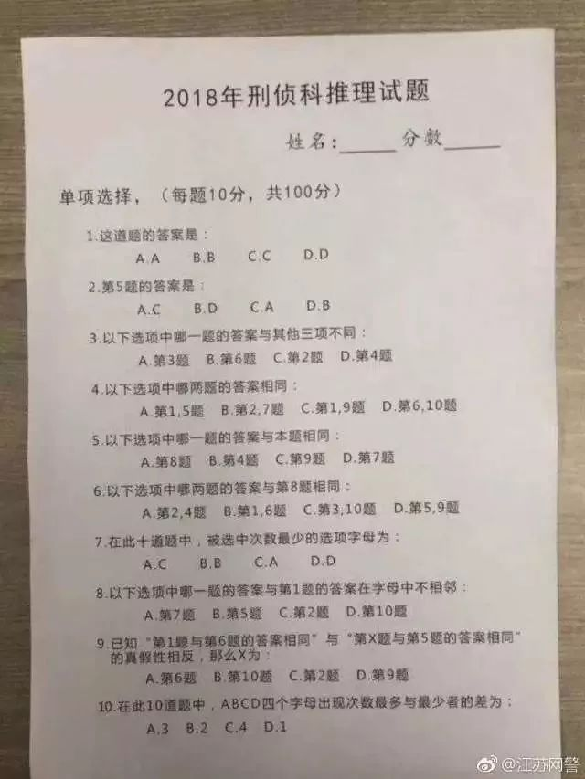
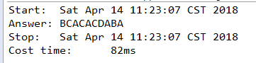

# InferenceSolution
网传2018刑侦科推理试题的java版穷举解法。

---
## 题目

---
## 思路

1. 总共有4的10次方种情况，因此10个for循环，每个循环有4次。
2. 将这10个for循环产生的10个数依次判断10道题的条件。
3. 第1题：不需要计算。
4. 第2题：先列举选项，再判断选项内容。
5. 第3题：先列举选项不同于其他三项的情况，再判断选项内容。
6. 第4题：先列举选项，再判断选项内容。
7. 第5题：先列举选项，再判断选项内容。
8. 第6题：先列举选项，再判断选项内容。
9. 第7题：先统计次数，再列举选项，然后判断选项内容。
10. 第8题：先列举选项，再判断选项内容，绝对值大于1。
11. 第9题：分别假设前真后假、前假后真的情况，再列举选项，然后判断选项内容。
12. 第10题：先统计次数，再列举选项，然后判断选项内容。
13. 同时满足以上10个条件则跳出所有循环，输出结果。
14. 用0，1，2，3分别表示A，B，C，D四个选项。

---
## 结果

耗时82毫秒。